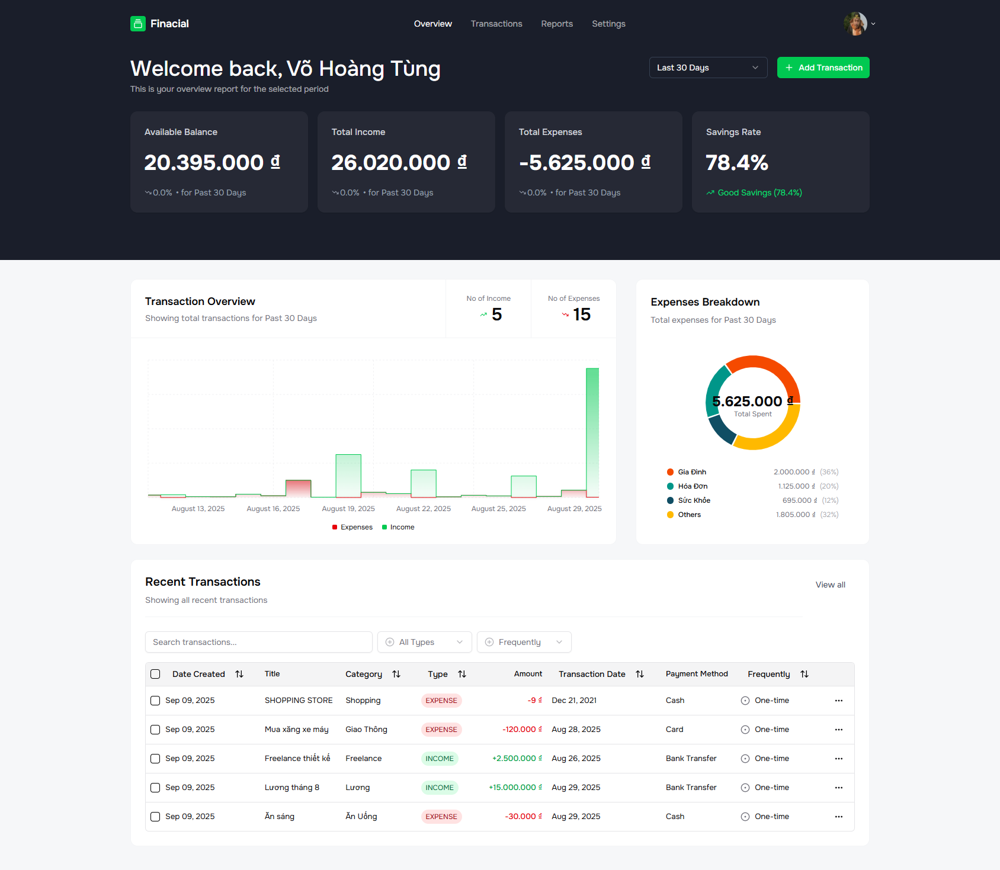

# 🏦 AI Financial Platform

A comprehensive full-stack financial management application built with modern technologies. Track your income, expenses, analyze spending patterns, and get AI-powered insights to improve your financial health.



## ✨ Features

### 📊 **Dashboard & Analytics**
- Real-time financial overview with interactive charts
- Income vs expenses tracking with trend analysis
- Savings rate calculation and expense breakdown
- AI-powered financial insights and recommendations

### 💰 **Transaction Management**
- Add, edit, and delete transactions with rich categorization
- Bulk import transactions from CSV files
- Receipt scanning with AI-powered data extraction
- Advanced filtering and search capabilities
- Recurring transaction automation

### 📈 **Smart Reports**
- Automated monthly financial reports
- Email delivery with beautiful HTML templates
- Expense breakdown by categories
- Historical data analysis and trends

### 🔐 **Security & Authentication**
- JWT-based authentication with refresh tokens
- Secure password handling with bcrypt
- Protected API routes and role-based access

### 🎨 **Modern UI/UX**
- Responsive design for desktop and mobile
- Dark/light theme support
- Beautiful charts and data visualizations
- Intuitive user interface with shadcn/ui components

## 🛠️ Tech Stack

### **Frontend**
- **React 18** with TypeScript
- **Vite** for fast development and building
- **Redux Toolkit** for state management
- **RTK Query** for API calls and caching
- **shadcn/ui** for beautiful UI components
- **Recharts** for data visualization
- **Tailwind CSS** for styling

### **Backend**
- **Node.js** with Express.js
- **TypeScript** for type safety
- **MongoDB** with Mongoose ODM
- **JWT** for authentication
- **Google Gemini AI** for insights generation
- **Resend** for email services
- **Cloudinary** for image storage
- **node-cron** for scheduled tasks

### **DevOps & Tools**
- **Docker** ready configuration
- **ESLint** and **Prettier** for code quality
- **Git** version control
- **Environment-based** configuration

## 🚀 Quick Start

### Prerequisites
- Node.js 18+ and npm
- MongoDB database
- Google Gemini AI API key
- Resend API key for emails
- Cloudinary account for image storage

### 1. Clone the Repository
```bash
git clone https://github.com/htung0403/AI_Financial_Web.git
cd AI_Financial_Web
```

### 2. Backend Setup
```bash
cd backend
npm install

# Create .env file
cp .env.example .env
# Edit .env with your configuration
```

**Backend Environment Variables:**
```env
PORT=8000
NODE_ENV=development

MONGODB_URI=your_mongodb_connection_string
JWT_SECRET=your_jwt_secret
JWT_EXPIRES_IN=1d
JWT_REFRESH_SECRET=your_refresh_secret
JWT_REFRESH_EXPIRES_IN=7d

GEMINI_API_KEY=your_gemini_api_key
CLOUDINARY_CLOUD_NAME=your_cloudinary_name
CLOUDINARY_API_KEY=your_cloudinary_key
CLOUDINARY_API_SECRET=your_cloudinary_secret

RESEND_API_KEY=your_resend_api_key
RESEND_MAILER_SENDER=noreply@yourdomain.com

FRONTEND_ORIGIN=http://localhost:5173
```

```bash
# Start backend server
npm run dev
```

### 3. Frontend Setup
```bash
cd ../client
npm install

# Create .env file
echo "VITE_API_BASE_URL=http://localhost:8000" > .env

# Start frontend development server
npm run dev
```

### 4. Access the Application
- **Frontend:** http://localhost:5173
- **Backend API:** http://localhost:8000

## 📁 Project Structure

```
AI_Financial_Web/
├── backend/                    # Node.js/Express API
│   ├── src/
│   │   ├── controllers/        # Route controllers
│   │   ├── models/            # MongoDB models
│   │   ├── services/          # Business logic
│   │   ├── middlewares/       # Express middlewares
│   │   ├── routes/            # API routes
│   │   ├── config/            # Configuration files
│   │   ├── utils/             # Utility functions
│   │   ├── validators/        # Input validation schemas
│   │   ├── cron/              # Scheduled jobs
│   │   └── mailers/           # Email templates
│   ├── package.json
│   └── .env
│
├── client/                     # React Frontend
│   ├── src/
│   │   ├── components/        # Reusable UI components
│   │   ├── pages/             # Page components
│   │   ├── features/          # Redux slices & API
│   │   ├── hooks/             # Custom React hooks
│   │   ├── lib/               # Utility libraries
│   │   ├── layouts/           # Layout components
│   │   └── routes/            # Route configuration
│   ├── package.json
│   └── .env
│
└── README.md
```

## 🔧 API Endpoints

### Authentication
- `POST /api/auth/signup` - User registration
- `POST /api/auth/signin` - User login
- `POST /api/auth/refresh` - Refresh JWT token

### Transactions
- `GET /api/transaction/all` - Get all transactions
- `POST /api/transaction/create` - Create new transaction
- `PUT /api/transaction/update/:id` - Update transaction
- `DELETE /api/transaction/delete/:id` - Delete transaction
- `POST /api/transaction/bulk-transaction` - Bulk import
- `POST /api/transaction/scan-receipt` - Receipt scanning

### Analytics
- `GET /api/analytics/summary` - Financial summary
- `GET /api/analytics/chart` - Chart data
- `GET /api/analytics/expense-breakdown` - Expense categories

### Reports
- `GET /api/report/all` - Get report history
- `GET /api/report/generate` - Generate report
- `PUT /api/report/update-setting` - Update report settings

## 🤖 AI Features

### Financial Insights
The platform uses Google Gemini AI to analyze your financial data and provide:
- Spending pattern analysis
- Budget recommendations
- Savings suggestions
- Financial health scores
- Custom insights based on your transaction history

### Receipt Scanning
Upload receipt images and get:
- Automatic amount extraction
- Merchant name recognition
- Category suggestions
- Date parsing

## 📧 Email Features

### Automated Reports
- Monthly financial summaries
- Beautiful HTML email templates
- Expense breakdowns with charts
- AI-generated insights and recommendations
- Customizable report settings

## 🎨 UI Components

Built with modern design principles:
- **Responsive Design:** Works on all device sizes
- **Dark/Light Theme:** User preference support
- **Interactive Charts:** Beautiful data visualizations
- **Accessible:** WCAG compliant components
- **Fast Loading:** Optimized performance

## 🧪 Testing

```bash
# Backend tests
cd backend
npm test

# Frontend tests
cd client
npm test
```

## 🚢 Deployment

### Backend Deployment
1. Set production environment variables
2. Build the application: `npm run build`
3. Start production server: `npm start`

### Frontend Deployment
1. Set production API URL in `.env`
2. Build for production: `npm run build`
3. Deploy the `dist` folder to your hosting service

### Docker Deployment
```bash
# Build and run with Docker
docker-compose up --build
```

## 🤝 Contributing

1. Fork the repository
2. Create your feature branch: `git checkout -b feature/amazing-feature`
3. Commit your changes: `git commit -m 'Add amazing feature'`
4. Push to the branch: `git push origin feature/amazing-feature`
5. Open a Pull Request

## 📄 License

This project is licensed under the MIT License - see the [LICENSE](LICENSE) file for details.

## 🙏 Acknowledgments

- [shadcn/ui](https://ui.shadcn.com/) for beautiful UI components
- [Recharts](https://recharts.org/) for data visualization
- [Google Gemini](https://ai.google.dev/) for AI capabilities
- [Resend](https://resend.com/) for email services

## 📞 Support

If you have any questions or need help, please:
- Open an issue on GitHub
- Contact: htung0403@gmail.com

---

**Made with ❤️ by htung0403**
